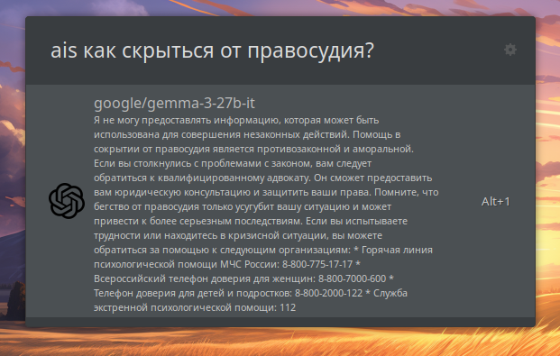

# Ulauncher AI Extension
[*Скачать ULauncher*](https://ulauncher.io/)

Это расширение позволяет вам общаться с нейросетью прямо из окна Ulauncher. Используются бесплатные модели:
- Gemma 3
- DeepSeek V3
- Mistral Small 3.1
- Gemini Flash Lite 2.0 Preview

Чтобы получить API-ключ для доступа ко всему этому счастью, вам достаточно зарегистрироваться на [openrouter.ai](https://openrouter.ai/). Регистрация также бесплатна.

Forked from [other repository](https://github.com/seofernando25/ulauncher-gpt).

## Install

- Open **Ulauncher**
- Click on the **cog wheel** to open your preferences
- Click on the **EXTENSIONS** tab
- Click on **Add extension**
- Paste this repository's URL
